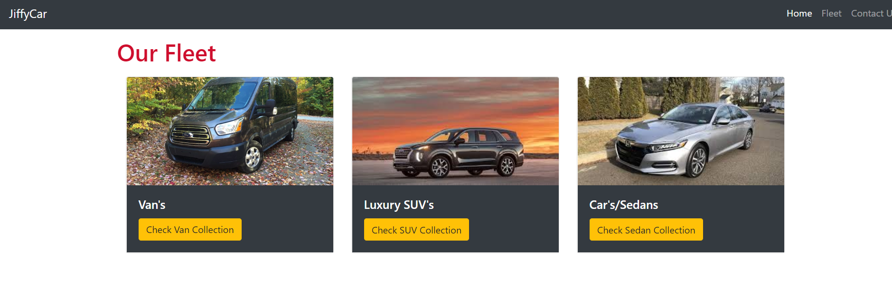

# JiffyCars

### Overview
JiffyCar is JavaScript,jQuery based car rental app. This app displays to the user vehicles in three catagories: vans's,suv's and sedan cars. App allows user to view,create,update and delete car details. App data is stored using Google's cloud based [Firebase](https://firebase.google.com/) database.

Here is snapshot of 'fleet' page which displays car catagories.

Here is snapshot of 'Van' page which displays van's added in the app.

### Steps to install the app
* Clone or download this repository.
* Change directory to 'JiffyCars'
* To view the app, in your browser open index.html file. 

### Technologies Used
* [Bootstrap](https://getbootstrap.com/) - Framework used for front-end 
* Javascript
* jQuery
* [Firebase](https://firebase.google.com/) - Online database.
